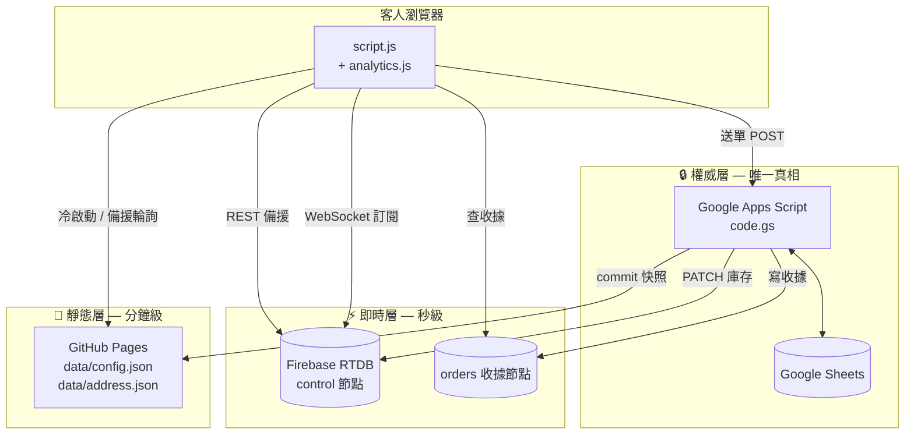

# 🥑 波波酪梨 線上訂購系統 (Pro-Bro Avocado)

> 台灣酪梨產地直送・限量秒殺型 D2C 訂購系統
> 無實體店面、無電商平台、無伺服器主機 —— 全部跑在 Google Apps Script + Firebase + GitHub Pages 上。

**目前版本:`code.gs` v9 ／ `script.js` v6 ／ `analytics.js` v2.0 ／ `style.css` v7 ／ `ga4.gs` v1.0**
最後一次安全稽核:2026-08-21(結果見[安全章節](#-安全性稽核))

---

## 目錄

- [一句話說明](#一句話說明)
- [系統架構](#系統架構)
- [檔案與職責](#檔案與職責)
- [兩條資料路徑](#兩條資料路徑)
- [試算表結構](#試算表結構)
- [設定與密鑰清單](#設定與密鑰清單)
- [觸發器清單](#觸發器清單)
- [部署順序](#部署順序)
- [開賣前 / 開賣後 SOP](#開賣前--開賣後-sop)
- [關鍵設計決策](#關鍵設計決策)
- [明確不做的事](#明確不做的事)
- [已知限制](#已知限制)
- [🔐 安全性稽核](#-安全性稽核)
- [疑難排解](#疑難排解)
- [待辦 / 路線圖](#待辦--路線圖)
- [變更紀錄](#變更紀錄)

---

## 一句話說明

限量庫存、開賣即秒殺。系統的唯一目標是:**在流量瞬間湧入的那 3~5 分鐘內,不超賣、不漏單、不讓任何失敗是靜默的。**

商業特性決定了所有技術選擇:

| 特性 | 對系統的意涵 |
|---|---|
| 庫存極少、客人極多 | 併發集中在數十秒內;庫存本身就是最好的限流器 |
| 一人技術 + 一人行銷 | 任何需要「兩份設定人工同步」的方案都不做 |
| 沒有客服團隊 | 客人卡住 = 直接流失,所以錯誤訊息必須告訴他「下一步該做什麼」 |
| GAS 有硬性吞吐上限 | 實測 0.25~0.69 訂單/秒,這是 Google 端的牆,不是程式碼問題 |

---

## 系統架構

### 資料依「變動速度」分層,不是依「資料種類」



| 層 | 內容 | 更新方式 | 掛掉的後果 |
|---|---|---|---|
| **即時層** Firebase `control` | 庫存數字、上架時間、訂單開關、三個配送開關、`dataAt` | 下單時 PATCH、編輯試算表時整份 PUT、每 15 分鐘保底推 | 自動降級為每 8 秒輪詢靜態層 |
| **靜態層** GitHub `config.json` | 品種介紹、圖片、公告、匯款資訊、價格與運費表 | 編輯試算表後發布(內容沒變就不發) | 自動退回打 `doGet?action=getConfig` |
| **權威層** GAS 讀試算表 | `processOrder` 的最終覆核 | 每次下單即時讀 | 全站無法下單 |

**錢和庫存的正確性只認權威層。** 前端傳來的 `subtotal` / `total` 從頭到尾不會被讀取。

### 三個必須先理解的觀念

**觀念一:兩把不同的鎖**

- `ScriptLock` → 客人下單(`processOrder`),必須又快又短,目標握鎖 200~400ms
- `UserLock` → 後台維護(編輯觸發 / 背景工人 / 快照發布 / PDF 認領),慢一點沒關係

共用同一把鎖會讓「你編輯試算表」把「客人下單」卡住好幾秒。

**觀念二:`dataAt` 是新鮮度,不是推播時間**

`dataAt` 記錄的是「這份資料何時從試算表讀出來」。前端只接受 `dataAt` 更大的推播。
用寫入時間排序會出事:訂單 A 在 T1 扣完庫存,編輯觸發在 T3 讀試算表,若 T3 的封包先到、A 的後到,用寫入時間會讓**比較舊的庫存贏**,客人看到已售完的品項還有貨。

**觀念三:誰有資格寫 control 的哪些欄位**(v8 修的最嚴重 bug)

| 路徑 | 可寫欄位 | 理由 |
|---|---|---|
| `syncControlToFirebase` | 全部(整份 PUT) | 拿了鎖、讀的是當下的試算表 |
| `processOrder` 鎖外收尾 | **只有** `json` / `dataAt` / `updatedAt`(PATCH) | 手上只有剛扣完的庫存,開關來自 20 秒快取 |

違反的後果:舊的開關值 + 最新的時間戳 → 前端新鮮度比對完全擋不住 → **緊急關單被一筆在途訂單靜默推回「開啟」**,且要等 15 分鐘保底維護才恢復。錢是安全的(後端會擋),但那 15 分鐘每個客人都白填一次表。

---

## 檔案與職責

### 後端(Google Apps Script,同一專案內多個 .gs 檔)

| 檔案 | 版本 | 職責 |
|---|---|---|
| `code.gs` | v9 | 核心:下單、庫存、快照發布、Firebase 推播、PDF、觸發器、統計 |
| `ga4.gs` | v1.0 | GA4 Measurement Protocol 後端補送(獨立檔案,不覆蓋 code.gs) |
| `shipping.gs` | — | 出貨通知 PWA 的後端(**刻意與 code.gs 分離**,避免部署風險波及下單) |
| `notify.gs` | — | 通知相關 |

> ⚠️ GAS 的所有 `.gs` 共用同一個全域作用域。新增檔案時,**任何 `const` 名稱重複都會讓整個專案報錯**(不只是那個檔案)。目前 `code.gs` 與 `ga4.gs` 的欄位常數刻意錯開(`COL_PHONE` vs `COL_ORDER_KEY` 等)。

> ⚠️ **GAS 編輯器不能傳參數給函式。** 需要參數的函式(`手動補印PDF([83])`、`解除手機限制("09...")`)無法從下拉選單直接執行 —— 要加一個無參數的包裝函式,填好值再執行:
> ```js
> function 補印一筆() { 手動補印PDF([83]); }   // ← 改列號再執行
> ```
> 下拉選單裡**只選括號內是空的那些函式**。

### 前端(GitHub Pages,`probroavocado.com`)

| 檔案 | 版本 | 職責 |
|---|---|---|
| `index.html` | — | 五步驟 SPA 骨架 |
| `script.js` | v6 | 全部業務邏輯:購物車、裝箱、送單、Firebase 訂閱、收據救援 |
| `analytics.js` | v2.0 | GA4 追蹤。**以掛鉤(hook)包裝既有全域函式**,不散進 script.js |
| `style.css` | v7 | 文青田園視覺(米白紙底 + 鼠尾草綠 + 暖褐棕印章色) |

**載入順序很重要:**
```html
<script src="analytics.js?v=2.0"></script>  <!-- 必須在前 -->
<script src="script.js"></script>
```
`analytics.js` 用 `DOMContentLoaded` 安裝掛鉤(此時兩檔都已解析完),並刻意用 `addEventListener` 而非 `window.onload =`(後者會與 script.js 互相覆蓋)。

### 出貨通知 PWA(獨立 repo `probro-shipping-notice`)

四個分頁:出貨拍照 / 發送通知 / 超取建單 / 設定。離線優先,IndexedDB `probro-ship`,SW 快取 `probro-ship-v1.x.x`。讀取資料來自「出貨通知」FILTER 公式分頁(不是原始資料表)。

---

## 兩條資料路徑

### A. 客人下單(`doPost` → `processOrder`)

```
1. 鎖外唯讀檢查
   ├─ 訂單開關 / 上架時間 / 配送開關（20 秒快取）
   ├─ calculateServerTotals：單價、斤數白名單、數量、裝箱、運費全部重算
   ├─ [FEE_MISMATCH] 前後端運費比對（只記錄，不擋單）
   ├─ 手機號碼頻率限制（3 筆成功 / 10 分鐘）
   ├─ orderKey 格式驗證 → [BAD_ORDER_KEY]
   └─ orderKey 去重（快取；isRetry 時多查一次 Firebase 收據）
                 ↓
2. 🔒 ScriptLock（waitLock 20 秒）
   ├─ 再確認一次去重
   ├─ 全部品項先檢查庫存夠不夠，確定都夠才動手扣
   ├─ 寫回庫存（連續 → setValues 一次；不連續 → 逐格）
   ├─ appendRow 寫訂單（17 欄）
   ├─ 電話 setNumberFormat('@').setValue() ← 必須在鎖內、flush 前
   └─ SpreadsheetApp.flush() ← 不 flush 就放鎖會超賣
                 ↓
3. 鎖外收尾
   ├─ 單次 PATCH：庫存 + 訂單收據（省一趟往返）
   ├─ 記錄手機下單、累加統計
   └─ setProperties: HAS_PENDING_PDF / HAS_PENDING_GA4 / LAST_ORDER_MS
```

**送單失敗的救援鏈**(實測 60 併發時約 1/3 的成功訂單客戶端會誤判為失敗):

```
GAS 回 HTML 錯誤頁 → 前端 JSON.parse 失敗 → SERVER_TIMEOUT_NON_JSON
  → waitForOrderReceipt() 以 3/5/8/12 秒間隔（+隨機）查 Firebase 收據
    → 查到 → 直接帶去成功頁 ✅
    → 查不到 → 保留 orderKey，請客人「再按一次確認訂購」
      → 重按時前端先查收據 → 查到就跳成功頁（跳過庫存預檢查）
      → 查不到才真的重送，後端用同一 orderKey 去重
```

> 這條鏈路修掉了一個死路:第一次其實成功了、庫存被自己買走 → 重按時庫存預檢查失敗 → `trimCartToStock()` 清空購物車 → 再按說「購物車是空的」 → 客人卡死但訂單其實成立了。**秒殺尾聲最容易踩到。**

### B. 後台維護(UserLock)

| 觸發 | 頻率 | 做什麼 |
|---|---|---|
| `onSheetEditTrigger` | 每次編輯 | 清設定快取 → 推 Firebase(不防抖)→ 同步工人模式 → 發布快照(防抖 10 秒;改 F2/F3 時不防抖) |
| `processPendingTasks` | 備戰 1 分 / 待機 10 分 | 補推控制節點、補寫收據、節流快照、印 PDF、補送 GA4 |
| `scheduledMaintenance` | 15 分 | 保底做完上述全部 + 復原卡住的 PDF + 清理過期收據 + 修電話 + 重排開賣觸發器 |
| `onReleaseTimeReached` | 一次性 | 開賣時間 +3 秒。**若 60 秒內有訂單則整個跳過**(它做的事訂單自己都會做) |

**三段式讓路機制**(PDF 與 GA4 共用同一套判斷):

| 條件 | 行為 |
|---|---|
| 距開賣時間 ±3 分鐘(讀 ScriptProperties 快取,不碰試算表) | 整輪跳過 |
| 45 秒內有訂單 | 整輪跳過 |
| 45~90 秒內有訂單 | 降速為 2 張 |
| 90 秒後 | 全速 8 張 |

理由:每張 PDF 至少兩次 `setValue` + Drive 的 `makeCopy`/`saveAndClose`,爭的是「客人搶不搶得到貨」的同一份試算表併發額度。**PDF 晚兩分鐘只是你晚點看到;下單被拖慢是客人搶不到貨。**

---

## 試算表結構

### 分頁

| 分頁 | 常數 | 內容 |
|---|---|---|
| `庫存管理` | `SHEET_STOCK` | A=規格標籤 B=剩餘庫存;F2=上架日期 F3=上架時間;I2=背景工人模式 |
| `訂單資料` | `SHEET_ORDER` | 見下方欄位表 |
| `1-首頁公告&設定` | `SHEET_HOME` | 參數型(A=名稱 B=值),含「訂單開關」 |
| `2-品種介紹` | `SHEET_VARIETY` | 清單型:A=名稱 B=特色 C=圖片URL D=狀態(上架) E=圖片ID |
| `3-訂購與運費` | `SHEET_ORDERCFG` | 參數型,含四個單價、九個運費欄位、三個配送開關、備註文案 |
| `4-匯款資訊` | `SHEET_BANK` | 參數型 |
| `地址對照` | `SHEET_ADDRESS` | A=縣市 B=區域 C=郵遞區號 |
| `出貨通知` | — | FILTER 公式分頁,供 shipping.gs 讀取 |

### 訂單資料欄位(A~Q)

| 欄 | 內容 | 常數 |
|---|---|---|
| A | 訂購日期 | `COL_ORDER_DATE` |
| B | 商品明細(`品名 3 斤 × 2`,每列一項) | `COL_ORDER_PRODUCT` |
| C | *(保留,目前為空)* | |
| D | 配送方式顯示名 | |
| E | 小計 | |
| F | 運費 | `COL_SHIPPING_FEE` |
| G | 總計 | `COL_TOTAL` |
| H | 姓名 | |
| I | 電話(**必須是文字格式**) | `COL_PHONE` |
| J | 地址 / 7-11 門市 | |
| K | 備註 | `COL_NOTE` |
| L | PDF 狀態(待處理→處理中→完成) | `COL_PDF_STATUS` |
| M | 訂單識別碼 orderKey | `COL_ORDER_KEY` |
| N | GA_CLIENT_ID | `COL_GA_CLIENT_ID` |
| O | GA_SESSION_ID | `COL_GA_SESSION_ID` |
| P | GA4_STATUS(空/已送出/無CID/過期) | `COL_GA4_STATUS` |
| Q | 裝箱明細 | `COL_BOXES` |

### 商品與配送(單一真相來源)

前後端各有一份 `商品定義` / `配送方式定義` / `運費欄位定義`,**必須人工保持一致**(一個在 GAS、一個在瀏覽器,無法共用程式碼)。

| 商品 | 斤數 | 縮寫(Q 欄用) |
|---|---|---|
| 當季酪梨(隨機出貨)【優級】 | 3 / 5 / 7 / 10 | 當季【優】 |
| 當季酪梨(隨機出貨)【次級】 | 3 / 5 / 7 / 10 | 當季【次】 |
| 平克頓/哈斯【優級】 | 1 / 2 / 3 | 平克【優】 |
| 平克頓/哈斯【次級】 | 1 / 2 / 3 | 平克【次】 |

> v9 起,上表的斤數同時是**後端的白名單**(`合法斤數`)。偽造不存在的規格會被明確擋下,不再是靠「庫存表剛好沒有那一列」的巧合。

| 配送 | 單箱限重 | 開關欄位 |
|---|---|---|
| 中華郵政 `post` | 10 斤 | 中華郵政配送 |
| 7-11 `711` | 7 斤 | 7-11超取配送 |
| 黑貓宅急便 `blackcat` | 10 斤 | 黑貓配送 |

> **「限重」是單箱,不是整筆訂單。** 客人可以下超過 10 斤,系統會自動拆箱、每箱各算一次運費。

### 裝箱演算法

目標函式是**總運費**,不是箱數 —— 運費是級距制,塞越滿不一定越便宜:

```
4 個 3 斤走宅配（上限 10）
  9斤 + 3斤 → 2 箱：大級距 + 小級距   ← 標準 FFD 會給這個
  6斤 + 6斤 → 2 箱：小級距 + 小級距   ← 一樣箱數，但便宜
```

- DP + 記憶化,狀態是「各重量還剩幾件」的計數向量(不是排列)
- 正規化:剩下最重的那一件一定放進「這一箱」,避免同一組裝法被重複計算
- 決定性:固定排序 + 固定枚舉順序 + 只在嚴格更好時替換 → 同一購物車永遠同一答案
- 超過 `裝箱單位數上限`(20) 或 `裝箱狀態數上限`(50000) → 降級為貪婪 first-fit
- 「分開寄出」UI 只在**合併確實較便宜且箱數差 ≤ 2** 時顯示(差太大就不是選擇而是陷阱)

---

## 設定與密鑰清單

### Script Properties(專案設定 → 指令碼屬性)

**密鑰類(絕不進版控)**

| Key | 用途 |
|---|---|
| `FIREBASE_SA_KEY` | 服務帳戶 JSON 全文(**目前使用中**) |
| `FIREBASE_SECRET` | Legacy database secret(**已移除,不再設定**) |
| `GITHUB_TOKEN` | fine-grained token,需 Contents: Read and write |
| `GA4_API_SECRET` | GA4 Measurement Protocol 密鑰 |
| `SHIP_TOKEN` | 出貨 PWA 存取權杖(逗號分隔支援多組) |

**設定類**:`GA4_MEASUREMENT_ID`、`GA4_ENABLED`

**狀態類(系統自行維護,不要手動改)**
`GITHUB_FILE_SHA`、`GITHUB_ADDRESS_FILE_SHA`、`SNAPSHOT_CONTENT_HASH`、`SNAPSHOT_LAST_PUBLISH_MS`、`SNAPSHOT_LAST_ATTEMPT_MS`、`SNAPSHOT_NEEDS_UPDATE`、`SNAPSHOT_BLOCKED_REASON`、`SNAPSHOT_BLOCKED_AT`、`CONTROL_NEEDS_PUSH`、`HAS_PENDING_PDF`、`HAS_PENDING_GA4`、`PHONE_NEEDS_FIX`、`LAST_ORDER_MS`、`LAST_EDIT_PUBLISH_MS`、`CACHED_RELEASE_AT`、`SCHEDULED_RELEASE_AT`、`WORKER_INTERVAL`、`PDFCLAIM_{列號}`、`STAT_*`、`ADDRESS_SNAPSHOT_LAST_ATTEMPT`

### CacheService keys

`ORDER_CFG_V3`(20 秒,下單用設定)、`ORDKEY_{orderKey}`(6 小時,去重)、`PHRATE_{手機}`(10 分鐘,限流)、`FB_ACCESS_TOKEN`(50 分鐘)

### 前端常數(`script.js` 頂部)

`GAS_URL`、`CONFIG_JSON_URL`、`ADDRESS_JSON_URL`、`FIREBASE_DB_URL`
輪詢:`POLL_MS_FAST` 8s(Firebase 未連線)/ `POLL_MS_SLOW` 60s(已連線)

---

## 觸發器清單

| 函式 | 類型 | 頻率 | 建立方式 |
|---|---|---|---|
| `onSheetEditTrigger` | 試算表 onEdit | 即時 | `setupSheetEditTrigger()` |
| `processPendingTasks` | 時間 | 1 或 10 分 | `setupTimeTriggers()`,依 I2 自動切換 |
| `scheduledMaintenance` | 時間 | 15 分 | `setupTimeTriggers()` |
| `onReleaseTimeReached` | 時間(一次性) | 開賣 +3 秒 | 由 `scheduleReleaseTimeTrigger()` 自動排定 |

> GAS 每專案上限 20 個觸發器。v8 起 `scheduleReleaseTimeTrigger` 與 `切換工人頻率` 都有「已經對了就完全不動」的保護 —— 舊版無條件先刪再建,若刪除成功但建立失敗,開賣觸發器會**永久消失且不會通知你**。

**背景工人模式(`庫存管理` I2)**

| 值 | 頻率 | 使用時機 |
|---|---|---|
| `備戰` | 1 分鐘 | 開賣前後 |
| `待機` | 10 分鐘 | 沒在賣的日子(省配額,也避免執行紀錄被洗掉) |

刻意**不做自動判斷**:有時是直接手動加庫存開賣的,那時 F2 是空的,自動邏輯會永遠停在待機且靜默失效。改為手動 + `驗證工人模式設定()` 在 I2 寫附註警告(有庫存卻在待機時)。忘記切的後果是「維持現狀」而不是「系統罷工」,這個不對稱很重要。

---

## 部署順序

> **鐵則:`code.gs` 一定要「部署新版本」(不是只按儲存),而且要在推前端之前。**

```
1. 貼上 code.gs / ga4.gs → 儲存
2. 部署 → 管理部署作業 → 編輯 → 版本選「新版本」 → 部署
   （網址不變；只儲存不部署，線上跑的還是舊版）
3. 執行 setupTimeTriggers()（改過工人模式邏輯時）
4. 執行 開賣前體檢() 確認全綠
5. git push 前端 → 等 GitHub Pages 建置完成（20~60 秒）
6. 硬重新整理網站確認版本
```

> **例外:純手動執行的維護函式不用部署。** 只在編輯器裡按執行的東西(各種 `檢查*()`、`診斷*()`、`修復*()`)存檔就生效,因為它們不經過 Web App。只有 `doGet` / `doPost` 會走部署版本。

### 首次建置

```
1. 建立試算表與七個分頁
2. Firebase 專案 → 設定安全規則（見安全章節）→ 建立服務帳戶
3. 設定 Script Properties（密鑰）
4. 執行 檢查Firebase認證()
5. 執行 初始化Firebase控制節點()
6. 執行 setupSheetEditTrigger()
7. 執行 setupTimeTriggers()
8. 執行 publishAddressSnapshot()
9. 執行 設定GA4參數() → 測試GA4連線()
10. 執行 開賣前體檢()
```

---

## 開賣前 / 開賣後 SOP

### 開賣前

```js
開賣前體檢()      // 一次跑完 8 項檢查，全綠才開賣
重設戰況統計()     // 讓數字只涵蓋這一場
```

`開賣前體檢()` 涵蓋:工人模式 → 觸發器 → 時區與開賣時間 → 上架時間設定 → Firebase 認證 → PDF 樣板 → 快照狀態 → GA4 追蹤。

手動確認清單:
- [ ] `庫存管理` **F2/F3 填好開賣時間**(產季外是空的)
- [ ] `庫存管理` **I2 = 備戰**
- [ ] 庫存數字已填
- [ ] 四個單價已填(非產季填 0 是**正常**,不是故障)
- [ ] 三個配送開關狀態正確
- [ ] 自己開一次網站,載入畫面出現「🔥 即時庫存已連線」

### 開賣後

```js
檢查戰況()   // 成功筆數、鎖逾時、重試救回、重複攔截、推播失敗
```

> ⚠️ ScriptProperties 的「讀出來 +1 再寫回去」不是原子操作,併發時會少算 —— 而鎖逾時本來就只發生在併發最嚴重的時候。**這些數字請當成「至少發生這麼多次」的下限**,看趨勢有意義,做精算沒有意義。

判讀:

| 鎖逾時比例 | 意義 |
|---|---|
| 0% | 還在舒適區,下次可以往上加量 |
| < 10% | 輕微排隊,健康但已摸到邊 |
| ≥ 10% | 明顯壅塞,下次不要再加量 |

GA4 端可看 `order_recovered` 事件 —— 它量化的是「客戶端顯示失敗、伺服器其實成功」那一批(壓測約 25%),而且是在真實流量下量的。

賣完之後別忘了:**清空 F2、I2 改回「待機」**。

---

## 關鍵設計決策

### 1. 靜默失敗是最高成本的 bug 類別

歷史事故:
- **整季休耕被誤判成設定壞掉**:四個單價填 0 → 舊版用「單價 > 0 的數量是否為 0」判斷設定損毀 → 拒發快照卻 `return true` → 執行紀錄全綠、每分鐘照跑,實際已停止對外發布好幾小時。
  **修法:判斷依據改成「欄位找不找得到」(`cfgGet` 回 `undefined`)而不是「值大不大於 0」。** 前後端都是。
- 快照發布被擋 → 加 `SNAPSHOT_BLOCKED_REASON` 旗標,`檢查快照狀態()` 與 `開賣前體檢()` 都看得見
- `GITHUB_TOKEN` 過期(401/403/404)→ 分別給出不同原因訊息(404 特別容易中:regenerate 時漏勾 Repository access)
- PDF 卡在「處理中」 → 認領時間戳 + 單輪時間守門 + 15 分鐘卡住偵測,三道防線
- `onEdit` 對長時間常駐的分頁有機率完全不觸發(Google 已知行為)→ 備戰模式每分鐘無條件補推控制節點
- **`{{weight}}` 在 PDF 上印了很久的空白**(讀的是保留欄 C)—— 空白看起來只像「這欄沒填」,不會有人覺得是 bug。v9 修正。

**原則:任何「不重試」的決定,都必須配一個看得見的旗標。**

### 2. 用實驗取代推論

檔案裡保留了兩支診斷函式,都是「猜錯過所以改用實驗」的產物:

| 函式 | 當初的問題 |
|---|---|
| `診斷電話寫入()` | 電話開頭的 0 被吃掉,連續猜錯三次寫法 |
| `診斷PDF金額符號()` | 不確定 `replaceText` 會不會把 `$500` 當群組參照 |

兩支都會自己清理測試資料,不留痕跡。**遇到「我覺得應該是這樣」的時候,寫個十行的診斷比爭論便宜太多。**

> `診斷PDF金額符號()` 的結論(2026-08-21):`replaceText` **不會**特殊處理 `$`,所以 `PDF_ESCAPE_DOLLAR` 維持 `false`。換樣板後可以再跑一次確認。

### 3. 快照內容雜湊比對

`計算內容雜湊(config)` 只涵蓋設定本身,刻意排除 `updatedAt` / `serverNow` —— 那正是舊版「什麼都沒改卻每 15 分鐘產生一次 commit」的原因。內容沒變就跳過發布,但每 12 小時仍強制發一次作為「檔案被誤刪」的保險。

連帶影響:**「快照很舊」不再是健康問題**。前端的健康指標因此改用 Firebase `control.updatedAt`(保底維護每 15 分鐘無條件推一次),否則休耕期客人會天天看到假警報。

### 4. 電話號碼的三次冤枉路

```
✗ 把整欄設成文字格式      → appendRow 照樣做數值解析
✗ 在字串前面加單引號       → API 寫入時單引號變成內容的一部分
✓ appendRow 後 setNumberFormat('@').setValue()
```
且**必須在鎖內、flush 之前**。舊版放在鎖外,高併發時撞上「同時呼叫服務的次數過多:試算表」而靜默失敗(壓測 27 筆全掛)。代價是握鎖多 100~150ms,但電話少一碼是真的聯絡不到客人。

### 5. 前端擋單保護後端

秒殺時最有效的一道是 `verifyStockBeforeSubmit()`:Firebase 連線中時直接用畫面上的庫存比對(不再多打一次快照,那份反而更舊)。**庫存歸零後的送出會被擋在瀏覽器裡,不會變成一次 GAS 執行。**

同理:`updateOrderPageStopState()` 讓緊急關單在訂購頁就看得見(舊版只有首頁按鈕變灰,已走到訂購頁的客人 —— 也就是最積極的那群 —— 完全看不出來)。

### 6. 提示佇列而非覆寫

`customAlert` 改為佇列制。舊版後一則會吃掉前一則,最常見災情:「庫存不足」和「已自動調整購物車」幾乎同時發出,客人只看到其中一則,於是不知道購物車被改過了。

### 7. GA4 用掛鉤而非散進 script.js

`script.js` 還在演進。散進九個插入點的話,每次改版都要重新對齊,而漏掉一處是靜默失效。掛鉤方案下:追蹤邏輯集中在一個檔案、`script.js` 只需改一處(把 `PBTrack.getIds()` 塞進送單 payload)、要停用就註解掉那行 `<script>`。

三條鐵則:絕不弄壞下單(先呼叫原函式再追蹤,追蹤包 try/catch)、絕不進入關鍵路徑(不攔 fetch、不加等待)、purchase 以 orderKey 去重(記憶體 + localStorage 雙層)。

### 8. 用 `own()` 而不是直接 `obj[key]`(v9)

所有查表(價格表、庫存對照、限重表)都是 `{}` 建的,而 key 來自前端:

```js
const t = {};
t['constructor']  // 不是 undefined，是 Object 建構子
t['toString']     // 也不是 undefined
```

所以「找不到就擋下來」的判斷會失效,程式往下走才在別的地方拋錯 —— 執行紀錄上出現一個看不懂的訊息,而真正的原因在三十行之前。`own()` 只在物件自己身上找,把「莫名其妙的錯誤」變成「明確的錯誤」。

---

## 明確不做的事

| # | 項目 | 理由 |
|---|---|---|
| 1 | **7-11 離島門市阻擋** | 門市是自由輸入欄位,客人可能只填店號 → 關鍵字比對天生有漏網,永遠只能是輔助不能是最終防線。既然如此,做成會擋單的硬檢查就不划算(誤判的客人當場流失且你永遠不會知道,還要維護兩份必須同步的清單)。改人工聯繫,彈性更大。 |
| 2 | **訂單資料歸檔** | 壓測三輪速率無下滑,`appendRow` 目前資料量下不受列數影響。 |
| 3 | **鎖逾時的前端自動重試** | 自動重試造成 retry storm 放大壅塞。改文案引導「等 3 秒再按一次」。 |
| 4 | **全域每分鐘訂單限流** | 秒殺模式下會誤傷真客人,且最可能觸發的時刻正好最不能出錯。只做同手機號碼層級。庫存本身就是最好的限流器。 |
| 5 | **忠誠點數** | 已從出貨通知系統移除。 |
| 6 | **PWA 保存原始照片** | 只保存加浮水印版本,簡化流程。 |
| 7 | **背景工人模式自動判斷** | 見「觸發器清單」的說明。 |
| 8 | **每筆訂單都排定快照更新** | 搶購中等於每分鐘一次 GitHub commit + Pages 建置,佇列越積越長。改由背景工人節流(搶購中最多 5 分鐘一次)。 |
| 9 | **改單重算模組**(2026-08 評估後放棄) | 曾寫過一個 `改單.gs`,能在客人臨時改品項/配送時自動重算 E/F/G/Q、調整庫存、重印 PDF。功能正確,但**操作流程太重**:要查列號 → 改包裝函式 → 預覽 → 再改 `執行:true` → 再執行,而這種需求一場開賣只有一兩次。**手動處理反而快。** 見下方「改單怎麼手動處理」。 |
| 10 | **裝箱單位數上限 20 → 30** | 評估後維持 20,目前沒有實際遇到需要的情況。若要改,**前後端必須同時改**,否則裝箱結果分岔。 |

### 改單怎麼手動處理

客人下單後要改品項或配送方式時,**在試算表上手動改**,但四件事一件都不能漏:

1. **B 欄商品明細** —— 格式要維持 `品名 3 斤 × 2`,每列一項
2. **E/F/G 小計、運費、總計** —— 這三格是下單當下算好寫死的靜態值,**改 B 欄它們不會跟著變**。運費要自己對照價目表級距
3. **Q 欄裝箱明細** —— 同樣不會重算,出貨當天你會照著它備箱子
4. **庫存管理 B 欄** —— 舊品項加回去、新品項扣掉

改完之後補印 PDF(記得 Drive 裡會有兩份同名檔案,刪掉舊的):

```js
function 補印一筆() { 手動補印PDF([83]); }   // ← 改列號後執行
```

> 順帶一提:GA4 上的營收會停在改單前的金額(已送出的事件無法修改,重送同一個 `transaction_id` 反而可能重複計算)。**筆數不受影響,金額以試算表為準。**

---

## 已知限制

| 限制 | 數字 / 說明 | 對策 |
|---|---|---|
| GAS 吞吐上限 | 0.25~0.69 訂單/秒(Google 端的牆) | 不是程式碼問題,別再優化那條路徑 |
| 客戶端假失敗 | 併發時約 25~33% 的成功訂單,客戶端誤判為失敗 | Firebase 收據救援,**不是重試** |
| 時間觸發器抖動 | 分鐘級,實測開賣觸發器晚 48 秒執行 | 前端自行倒數解鎖,觸發器只是保險 |
| 統計計數 | 併發時會少算 | 當成下限看趨勢 |
| LINE in-app 瀏覽器 | 剝除 referrer、storage 不穩、`client_id` 可能每次都新 | `browser_env` 維度切分報表 |
| `getLastRow()` on FILTER 分頁 | 回傳 2000(公式列數)即使資料只有幾列 | 出貨通知從第 2 列往下讀,不讀尾端 |
| 觸發器上限 | 20 個 | 已有防重複建立保護 |
| GAS 編輯器不能傳參數 | 需要參數的函式無法直接執行 | 加無參數的包裝函式 |

---

## 🔐 安全性稽核

**上次稽核:2026-08-21。九項全部處理完畢。**

| # | 項目 | 狀態 |
|---|---|---|
| 1 | Firebase 安全規則 | ✅ 已驗證 |
| 2 | Drive / 試算表 / repo 權限 | ✅ 已驗證 |
| 3 | `doPost` 無來源驗證 | ⏸️ 已知並接受 |
| 4 | `orderKey` 格式驗證 | ✅ v9 已修 |
| 5 | 斤數白名單 | ✅ v9 已修 |
| 6 | PDF 的 `$` 與 `{{weight}}` | ✅ v9 已驗證 / 已修 |
| 7 | 原型鏈污染 | ✅ v9 已修 |
| 8 | 前端 XSS 面 | ⏸️ 信任範圍內,列為長期 |
| 9 | 前端價格表 normKey | ✅ v6 已修 |

### #1 Firebase 安全規則 ✅

前端用**未認證的 REST / WebSocket** 讀 `control` 與 `orders`,所以規則是整個系統最脆弱的一環。若寫入開放,會有這些後果:

| 攻擊 | 後果 |
|---|---|
| 竄改 `control/json` | 顯示假庫存,客人白填表白打 GAS |
| 竄改 `control/orderSwitch` = 關 | **等於幫你關店**,你不會收到通知 |
| 把 `control/dataAt` 設成極大值 | 之後所有正常推播都被新鮮度比對忽略 → **畫面永久凍結** |
| 偽造 `orders/{key}` 收據 | 客人重試時查到假收據 → 跳成功頁,但**訂單根本不存在** |
| 列出整個 `orders` 節點 | 讀到全部訂單金額 → 推算營收 |

**目前狀態(2026-08-21 實測):**

| 測試 | 結果 |
|---|---|
| `GET /control.json` | 可讀 ✅(本來就該公開) |
| `GET /orders.json` | `Permission denied` ✅(不能列舉) |
| `GET /orders/{真實UUID}.json` | 回 `null` 而非拒絕 ✅(單筆可讀,收據救援是活的) |
| `PUT /_sectest.json` | 拒絕 ✅ |
| `PUT /control/_sectest.json` | 拒絕 ✅ |
| `PUT /orders/_sectest.json` | 拒絕 ✅ |

> **判讀重點:** Firebase 在讀取權限不足時會直接回 `Permission denied`,**不會**先檢查資料存不存在。所以單筆查詢回 `null` 而不是拒絕,就證明規則允許讀 —— 只是那筆收據已過 `RECEIPT_KEEP_HOURS`(24 小時)被清掉了。

目標規則形狀(後端走服務帳戶,不受規則限制):

```json
{
  "rules": {
    "control": { ".read": true,  ".write": false },
    "orders": {
      ".read": false,
      ".write": false,
      "$orderKey": { ".read": true, ".write": false }
    }
  }
}
```

**重新稽核用的指令**(換 Firebase 專案或改過規則後跑一次):

```powershell
$db = "https://<你的專案>-default-rtdb.asia-southeast1.firebasedatabase.app"

foreach ($p in @("_sectest", "control/_sectest", "orders/_sectest")) {
  try {
    Invoke-RestMethod -Method Put -Uri "$db/$p.json" -Body '"x"' -ContentType "application/json" | Out-Null
    Write-Host "[X] $p 可寫入 -- 有問題" -ForegroundColor Red
    Invoke-RestMethod -Method Delete -Uri "$db/$p.json" | Out-Null
  } catch {
    Write-Host "[OK] $p 拒絕寫入" -ForegroundColor Green
  }
}
```

再用瀏覽器開 `$db/orders.json`(應為 Permission denied)與 `$db/orders/{最近的orderKey}.json`(應為收據內容或 `null`,**不可是** Permission denied)。

### #2 Drive / 試算表 / repo 權限 ✅

| 項目 | 狀態 |
|---|---|
| 試算表 一般存取權 | 「限制」,只有本人與配偶 ✅ |
| `波波酪梨_訂單` 資料夾 | 同一信任範圍 ✅ |
| PDF 樣板 | 同上 ✅ |
| GAS 專案 | 同上 ✅ |

> **這是整個系統個資風險最高的一點**,遠比程式碼漏洞嚴重 —— 試算表裡有所有客人的姓名、電話、地址,PDF 資料夾裡每一張都是完整個資。
>
> **未來若要把編輯權開給第三人(行銷、工讀生),必須先做兩件事:**
> 1. 把 #8 的前端 XSS 面收斂(見下)
> 2. GAS 專案移出共用資料夾 —— 指令碼編輯者可以直接打開「專案設定 → 指令碼屬性」看到 `FIREBASE_SA_KEY`(Firebase 管理員權限)與 `GITHUB_TOKEN`(可改掉線上的 `script.js`),等於一次繞過 #1 和 #8

若 repo 為 public,`code.gs` 裡的 `試算表ID` 與 `PDF_TEMPLATE_DOC_ID` 會外流。權限鎖著所以打不開,但等於公開標示目標位置 —— **建議 repo 設 private,或公開版把這些 ID 換成佔位符。**

### #3 `doPost` 無來源驗證 ⏸️ 已知並接受

任何人都能直接 POST 訂單。價格覆核擋住金錢損失,但擋不住**灌單掃庫存**:腳本在開賣瞬間用不同手機號碼灌滿,庫存物理上就被吃光。手機限流對換號碼的腳本無效,而 GAS 拿不到 client IP,所以在 GAS 層面沒有好解法。

**現況評估:目前規模下風險可接受**(沒有轉售價差誘因、也還沒被盯上)。真的需要時的選項,由輕到重:

1. 在 payload 加一個由 `config.json` 提供、每場開賣輪替的 `saleToken`(擋掉最低階的腳本)
2. Cloudflare Turnstile + GAS 驗證(要多一次 UrlFetch,會吃掉尖峰吞吐 —— **不建議**)
3. 網域移到 Cloudflare,用 Worker 當下單前置閘道(rate limit by IP + Turnstile)再轉發到 GAS。這才是根治,但多一層要維運。

**這是已知並接受的風險,不是沒想過。** 出現異常灌單跡象時再啟動。

### #4~#7、#9 已修(v9 / v6)

| # | 修法 |
|---|---|
| 4 | `ORDER_KEY_PATTERN = /^[A-Za-z0-9_-]{8,60}$/`。不合格式當作沒帶識別碼(訂單照常成立),並記錄 `[BAD_ORDER_KEY]`。**原本的風險:orderKey 含 `. $ # [ ] /` 會讓 Firebase PATCH 回 400,而庫存推播與收據寫在同一個 PATCH 裡 —— 一行 payload 就能讓秒殺當下的即時庫存停更。** |
| 5 | `合法斤數` 白名單,由 `商品定義` 衍生。原本靠「庫存表剛好只有合法規格」的巧合擋住偽造規格。 |
| 6 | `診斷PDF金額符號()` 證實 `replaceText` 不特殊處理 `$` → `PDF_ESCAPE_DOLLAR = false`。`{{weight}}` 改由 `計算訂單總重_()` 從 B 欄算出(舊版讀永遠是空的 C 欄)。 |
| 7 | 新增 `own()`,所有前端輸入的查表都改走它。`cfgGet` 也改用。 |
| 9 | 前端 `價格表` 的 key 改用 `normKey`,與後端 v8 對齊。新增 `查單價(displayName)` 統一查價入口。 |

### #8 前端 XSS 面 ⏸️ 長期

這幾處把試算表內容直接塞進 `innerHTML`:

- `applyConfigToPage`:公告內容
- `renderVarieties`:品種名稱、特色,且 `onclick="showLightbox('${imgSrc}')"` —— 圖片 URL 含單引號就能跳出屬性
- `renderSuccessPage`:成功頁提醒文字

**目前試算表只有本人與配偶可編輯,屬於信任範圍,不急。** 但**在把編輯權開給第三人之前必須先做**:任何有編輯權的人就等同於能在你的網站上執行任意 JS,而客人此刻正在填姓名電話地址。

改法:`renderVarieties` 的 `onclick` 改成 `addEventListener` + `dataset.src`,文字改用 `textContent`,換行交給 CSS `white-space: pre-line`。`#spec-note` / `#shipping-note` 已經是正確做法,照抄即可。

### 已知並接受(不用改)

| 項目 | 說明 |
|---|---|
| 手機限流有競態 | 檢查與記錄都在鎖外,同手機同時送兩筆可能都通過。best-effort 足夠。 |
| `sanitizeCell` 會留下前綴單引號 | `=+-@` 開頭的內容會多一個 `'`,出貨單上看得到。防公式注入的必要代價。 |
| B 欄商品明細未經 sanitize | 靠「品項必須通過白名單覆核」保護。v9 加了斤數白名單後更穩。 |
| 後端不驗證電話格式 | 只有前端驗 `^09\d{8}$`。直接 POST 可塞任意字串,但無實際危害。 |
| `MIN_LOADING_MS = 2000` | 開賣前一秒進站的客人要多等 2 秒才看到頁面(不影響下單判斷)。 |
| `GA4_API_SECRET` 洩漏 | 只能偽造事件,不能讀資料。且只存在後端。 |
| `doGet?action=getConfig` 公開 | 回傳的都是網站本來就會顯示的內容(含匯款帳號 —— 那本來就印在成功頁上)。 |

---

## 疑難排解

| 症狀 | 先看這裡 |
|---|---|
| 改了試算表但網站沒變 | `檢查快照狀態()` —— 看有沒有 `SNAPSHOT_BLOCKED_REASON`;再看 `檢查Firebase控制節點()` 的 `updatedAt` |
| 網站顯示「系統維護中」 | `3-訂購與運費` A 欄的參數名稱被改壞了(多打/少打空格)。**注意:四個單價都是 0 不是故障,那是非產季** |
| 商品提早開賣了 | `檢查上架時間設定()` —— 常見是只填 F3 沒填 F2、或年份打錯。F2 上會有黃色附註 |
| 訂單卡在「處理中」 | `resetStuckPdfs()`,或等 15 分鐘保底維護自動處理 |
| 客人說下單後查不到 | `backfillMissingReceipts(50)`;順便檢查 I2 是不是還在「待機」 |
| 電話少了開頭的 0 | `repairRecentPhones(30)` 或 `修復電話欄()` |
| **GA4「有 client_id 比例只有 1%」** | **多半是正常的** —— `analytics.js` 上線前的舊訂單無法回補,只要有幾筆「已送出」就代表整條鏈路是活的。新訂單累積到 20 筆以上還是偏低才需要查 `PBTrack.getIds()` |
| 客人被限流擋住 | `解除手機限制("09xxxxxxxx")`(需包裝函式) |
| 前後端運費算出不同數字 | 執行紀錄搜尋 `[FEE_MISMATCH]`,通常是兩邊的「單一真相來源」不同步 |
| 訂單被拒絕但不知原因 | 執行紀錄搜尋 `[ORDER_REJECTED]` / `[LOCK_TIMEOUT]` / `[BAD_ORDER_KEY]` |
| 執行函式時說「請提供有效列號」 | 選錯函式了 —— 下拉選單裡**只選括號內是空的那些** |

### 常用維護函式速查

```js
// 檢查類
開賣前體檢()            // 一次跑完全部 8 項
檢查戰況()              // 這一場的成功/逾時/救回筆數
檢查快照狀態()           // 含「正在被擋下」的旗標
檢查Firebase控制節點()   // 看 Firebase 上實際存了什麼
檢查Firebase認證()
檢查工人模式()           // I2 設定 vs 實際觸發器
檢查觸發器()
檢查時區設定()           // 一次核對試算表 + 專案兩層
檢查上架時間設定()
檢查PDF樣板()
檢查GA4狀態()

// 診斷類（會自己清理，不留痕跡）
診斷電話寫入()
診斷PDF金額符號()

// 修復類
強制發布快照()
resetStuckPdfs()
backfillMissingReceipts(50)
repairRecentPhones(30) / 修復電話欄()

// 需要參數 → 要包裝函式
function 補印一筆() { 手動補印PDF([83]); }
function 解除限制() { 解除手機限制("0912345678"); }
function 重送() { 重送GA4([120, 121]); }

// 一次性設定
setupSheetEditTrigger()
setupTimeTriggers()
初始化Firebase控制節點()
publishAddressSnapshot()
設定GA4參數() / 測試GA4連線()

// 開賣前後
重設戰況統計()  →  (開賣)  →  檢查戰況()
```

---

## 待辦 / 路線圖

### 短期

- [ ] GA4 `purchase` 事件在下一場實際開賣時驗證(歷史資料無法回補)
- [ ] 觀察 v9 的 `[BAD_ORDER_KEY]` 是否曾出現(有的話代表有人在戳 `doPost`)

### 中期(產季外做)

- [ ] **Firebase Transactions 遷移**:把訂單寫入邏輯移到 Firebase,GAS 降級為非同步的同步 / PDF / 對帳層,Google Sheets 保留為紀錄層。
      **已知取捨:秒殺進行中手動改試算表庫存會被 Firebase 的值覆蓋** —— 已知悉並接受。
      目前系統在真實流量下已證明穩定,**不急**。
- [ ] LINE 物流查詢三階段方案(設計完成,未實作):
      1. GitHub Pages 自助查詢頁(最優先)
      2. 關鍵字 webhook 自動回覆(回覆訊息不計入額度)
      3. 主動推播(最低優先)
- [ ] 條碼掃描輸入物流單號(BarcodeDetector API / html5-qrcode),對 7-11 CSV 匯出流程特別有用

### 長期 / 觀望

- 下單前置閘道(Cloudflare Worker)—— 只在真的遇到灌單時才做
- 前端 XSS 面收斂 —— **在把試算表編輯權開給第三人之前必須先做**

---

## 追蹤與行銷

| 項目 | 值 |
|---|---|
| GA4 Measurement ID | `G-99EP460CDY` |
| 自訂維度 | 6 個已註冊 |
| 資料保留 | 14 個月 |
| LINE OA 選單 | `utm_source=line&utm_medium=oa` |
| Linktree 按鈕 | `utm_source=linktree&utm_medium=bio` |

Linktree 單一連結雙路由(新鮮酪梨 + 7-11 平台冷凍商品)。**刻意不做每平台 UTM** —— 單人維運下,維護成本高於資訊價值。

自訂事件(`analytics.js`):`sale_page_ready`、`sale_open`、`order_submit_attempt`、`order_submit_fail`(含 9 種 `fail_reason`)、`order_recovered`、`sold_out`、`retry_prompted`、`funnel_step`(SPA 沒有網址變化,沒有它就完全看不到客人走到哪一步)。

---

## 品牌

**文青田園**。溫暖米白紙底、鼠尾草綠山丘、暖褐棕印章色,衍生自 LINE 圖文選單與配送海報。標題用思源宋體(Noto Serif TC),內文用黑體確保訂購流程好讀。

```
--creamy      #FAF7EF   卡片紙色
--avo-green   #EDE8DA   頁面底色・霧米
--avo-dark    #3E4C33   深墨綠・標題
--text-main   #4B5540   內文墨色
--herb-green  #6F8A54   主行動綠・按鈕
--avo-accent  #9A7E5D   暖褐棕・金額強調（取自 LOGO 緞帶）
```

> ⚠️ **載入畫面與錯誤畫面的配色寫死在 `script.js` 的字串裡**(因為它們可能在 `style.css` 下載完成前就出現,CSS 變數還是空的)。改配色時記得一起改,否則客人進站會先看到舊配色,兩秒後才切換 —— 那是整個品牌的第一印象。

---

## 變更紀錄

### code.gs v9 ／ script.js v6(2026-08-21)

安全稽核後的修補,五項:

| # | 檔案 | 內容 |
|---|---|---|
| 4 | code.gs | `orderKey` 格式驗證(`ORDER_KEY_PATTERN`)+ `[BAD_ORDER_KEY]` 記錄 |
| 5 | code.gs | `合法斤數` 白名單,由 `商品定義` 衍生 |
| 6 | code.gs | `pdfSafeText_` / `PDF_ESCAPE_DOLLAR`(診斷後維持 false);`{{weight}}` 改由 `計算訂單總重_()` 從 B 欄算出 |
| 7 | code.gs | 新增 `own()`,`cfgGet` 與所有前端輸入的查表都改走它 |
| 9 | script.js | `價格表` 的 key 改用 `normKey`;新增 `查單價()` 統一查價入口 |

新增診斷函式:`診斷PDF金額符號()`

**未採納:** `改單.gs` 改單重算模組(操作流程太重,見「明確不做的事」#9)、`裝箱單位數上限` 20→30

### code.gs v8

1. 修正緊急關單被在途訂單推回開啟(訂單路徑改為只 PATCH `json`/`dataAt`/`updatedAt`)
2. 開賣觸發器不再每 15 分鐘刪除重建
3. 移除 7-11 離島阻擋
4. 價格表改用 `normKey` 建立與查詢
5. `processOrder` 收尾的兩次 `setProperty` 合併為一次 `setProperties`

### code.gs v7

修正「整季休耕」被誤判成「設定壞掉」而永久拒發快照;新增 `SNAPSHOT_BLOCKED_REASON` 旗標。

### code.gs v6

新增 `PDF_RELEASE_YIELD_MS`(開賣盲區);背景工人模式可從試算表 I2 切換。

---

## 給未來的自己 / 給 AI 助手的閱讀順序

1. 本文的 **[系統架構](#系統架構)** 三個觀念
2. `code.gs` 檔頭的版本註解(v6→v9 每個 bug 的完整原因鏈)
3. `script.js` 檔頭的改動說明
4. 本文的 **[明確不做的事](#明確不做的事)** —— 避免重新討論已經決定的事
5. 本文的 **[🔐 安全性稽核](#-安全性稽核)** —— 已處理的不用再提,`⏸️` 那三項是刻意接受的

**討論時的偏好:** 結論先行、給完整可部署的檔案區塊(不要 diff)、不為還沒遇到的邊緣情況過度設計。
